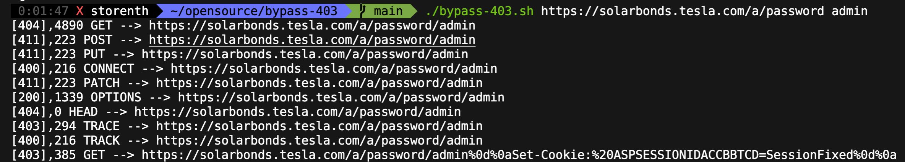

# Bypass-403
Bash script for bypassing 401/403 responses primarily for bugbounty and testing purposes



## Usage
```bash
./bypass-403.sh https://hackerone.com admin
```

## Features
- 34 known mechanisms to bypass 401/403 status codes
- GET POST PUT CONNECT PATCH OPTIONS HEAD TRACE TRACK methods using `curl`

## Install
```bash
git clone https://github.com/iamj0ker/bypass-403
cd bypass-403
chmod +x bypass-403.sh
./bypass-403.sh https://hostname.com directory2bypass
```

## Contributers
Project forked from [iamj0ker](https://github.com/iamj0ker/bypass-403) for personal use. There are no liabilities.

## Notable posts
- https://blog.vidocsecurity.com/blog/401-and-403-bypass-how-to-do-it-right/
